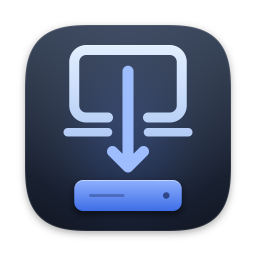
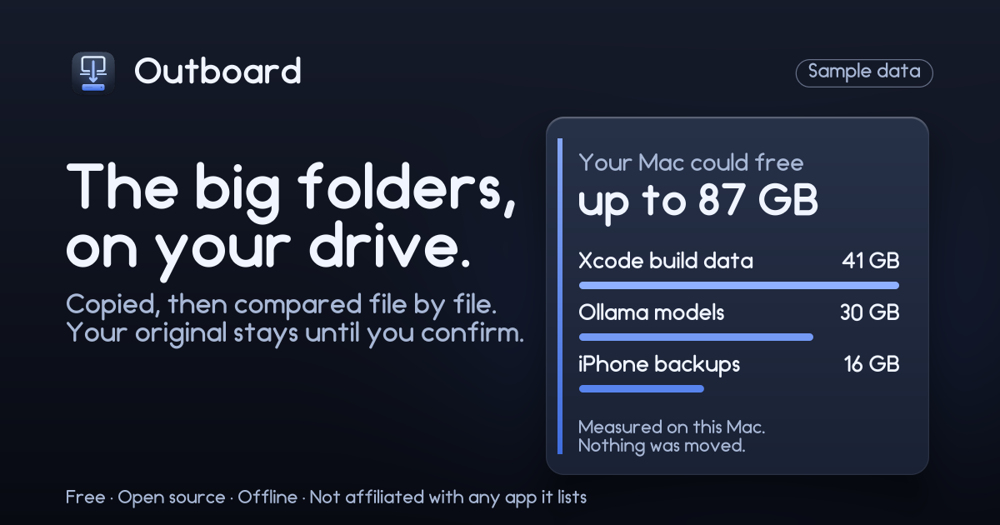

<p align="center"></p>

<h1 align="center">Outboard</h1>

<p align="center"><b>The big folders apps keep on your Mac, on your external drive. Every file checked.</b><br>
Free, open source, offline.</p>

Outboard is a **storage planner** for people with an external SSD. It measures the big folders that apps keep on your Mac (Xcode
build data, iPhone backups, Ollama and Hugging Face models ...), tells you which ones can be moved and how, moves the ones with a known
method, and guides you through the rest. A move copies the folder to your drive, **compares every file** with the original, switches
the app over, and keeps your original, renamed, until you confirm. **Every step is written to a log** you can read. While Outboard is
running, a **Drive Guard** announces a missing drive and puts a note where the folder was.

<p align="center"></p>

> The card above is **sample data** from demo mode. Real numbers will replace it once testers have run it.

**Status: in development. Not yet tried on a real Mac.** CI compiles and tests the code on GitHub's macOS runners once it is pushed,
but nobody has run Outboard on a real Mac with a real external drive yet. Everything below describes the design and the checks that
exist, not a result. Every move that changes anything is **hidden by default** (Preferences › "Show moves not yet tried on a real
Mac") and becomes a normal entry only after a named tester has tried it and [docs/VERIFY_LOG.md](docs/VERIFY_LOG.md) says so. See
[CHANGELOG.md](CHANGELOG.md).

## What it does, and what it does not

- **Does:** measure (read-only), move the catalogue's folders to a drive you choose, keep the original until you confirm, roll back
  before that, return a folder to the Mac, park a note when the drive disappears and put things back (and check them) when it returns.
- **Does not:** configure new installs by itself (macOS gives no hook for that), format, mount or eject a drive, make an external
  drive behave like internal storage, or say anything about speed. It cannot stop you unplugging a drive or make that harmless.
- **Never moves:** Mail, Safari, Messages and Notes data, anything inside iCloud Drive, sandboxed app containers, the Homebrew folder,
  your home folder, the whole `~/Library/Caches` folder, app bundles, Xcode simulator runtimes, Docker's disk image, pnpm and uv stores.
  They appear in the app as cards with the reason.
- **Refuses a drive that is:** a network volume, formatted FAT or exFAT, a Time Machine destination, a disk image, or (for the moves
  it does itself) a spinning hard disk. It prefers one APFS volume made for it.

### The catalogue

Recipes are plain data in [`Sources/OutboardCore/Recipes`](Sources/OutboardCore/Recipes): 7 moves Outboard does itself (Xcode build
data and archives through Xcode's own settings, Hugging Face, Ollama, llama.cpp and npm caches and iPhone backups through a link), 8
guided cards where the app has its own setting (Photos, Music, Final Cut Pro, Logic Pro, Steam, LM Studio, the Android SDK, the App
Store's large-apps switch) and 9 refusals. Adding or changing an entry is a small pull request that needs sources; a validator
(`python tools/check_recipes.py`), the Core tests and the owner's review gate it, and a recipe is marked as tried only with an entry in
the [verify log](docs/VERIFY_LOG.md).

## Trust box

- **No network.** Not an update check, not telemetry, not an account. CI rejects the network APIs. "Check for updates" opens the Releases page.
- **Nothing is deleted.** CI fails if the code calls `removeItem`, `unlink`, `rm` or any replace or exchange call. The original is
  renamed `<name>.before-move` and, only after you confirm, moved to the Trash with `FileManager.trashItem`.
- **One place per action.** `moveItem` is called from one file, `copyItem` from one, `createSymbolicLink` from one, `trashItem` from one,
  and the one `defaults write` from one. Each writes its line to the log before it acts and refuses to act if it cannot.
- **No shell.** The only child processes are `diskutil` (read-only), `tmutil destinationinfo` (read-only) and `defaults` for the
  catalogue's keys. No helper, no root, no `launchctl`, no signals. It never quits an app: it asks you to.
- **Unknown means no.** A check that cannot be answered refuses the move or asks you to tick a box. Nothing missing is treated as "yes".
- **Contents are read only to hash them,** and for Outboard's own log, manifests and markers.

## How a move works

1. **Choose a drive.** Outboard reads what macOS says about it and shows the result. It writes one small marker file in an `Outboard`
   folder on the drive, and nothing else until you start a move.
2. **Checks.** The app that owns the folder is not running; there is room for the copy plus a margin; nothing involved is in iCloud;
   the log can be written. A failed or unanswerable check stops the move.
3. **Copy and compare.** The folder is copied to a staging folder on the drive and every file is compared with the original by size and
   SHA-256. A single difference stops the move with your Mac unchanged.
4. **Switch.** The original is renamed to `<name>.before-move`; then the app's own setting is pointed at the copy, or a link is created
   where the folder was.
5. **Confirm or roll back.** Try the app. Confirm to send the original to the Trash, or roll back to put it back as it was.

If a crash or a pulled cable interrupts a move, the log is read on the next launch and the next step is chosen from what is on disk.
The recovery table never deletes, overwrites or merges a folder.

## What it cannot show

The activity log and the report show what Outboard did and checked. They do not show that your data is undamaged or that a drive is
reliable. Outboard has not been tried on every Mac or every drive. CI cannot show: sleep and wake ejection, real USB and Thunderbolt
unplug behaviour, what Photos, Ollama, Steam, Finder and Xcode do with a parked note, FileVault and login ordering, privacy prompts for
removable volumes and hashing hundreds of gigabytes over USB. Those stay open until testers try them (BUILD_PLAN section 12).

What the project will never claim is a CI check. `tools/banned_phrases.txt` lists the phrases, and `bash tools/safety_greps.sh` fails if one appears in `App/`, `Sources/`, `site/`, `.github/`, this README or the changelog without a marker that says why. <!-- no-claim-ok: describes the banned-phrase check -->

## The activity log

Each step is written to `~/Library/Application Support/Outboard/journal-YYYY-MM.jsonl` (readable only by you, one file per month,
append-only) **before** it happens, and its result after. It holds paths with `~` for your home folder (also in the saved values of an app's setting),
sizes, file counts, step names, the name and volume identifier of each drive you used, and short reason codes, never file contents or system error
text, and it never leaves your Mac. The same lines are what the Activity screen and the report show.

Two more things stay in `~/Library/Application Support/Outboard/`: `Manifests/`, one file per move that lists every file in the moved folder
with its relative path, size, modification time and SHA-256 hash (a copy of it sits beside the data on the drive), and `Parked/`, the links and
notes the Drive Guard moved aside while a drive was away. Nothing in either is sent anywhere, and Outboard deletes neither.

## Privacy

Outboard is offline: no analytics, no accounts, no crash reporting. The Storage Plan card never shows paths, file names, your name, drive
names or volume identifiers. The activity log and the manifests, which stay on your Mac, do hold drive names, volume identifiers and the
file names in a moved folder. The report shows drive names and the first characters of an identifier unless you turn on "Hide folder paths",
which also hides drive names and identifiers. GitHub serves the website and the downloads and sees visitors' addresses.

## Install

Until a Developer ID exists, public builds are unsigned betas, and macOS blocks the first launch:

1. Download `Outboard-<version>.zip` from [Releases](https://github.com/EverydayOpen/outboard/releases) and check it against
   the `Outboard-<version>.zip.sha256` file attached to the same release
   (`shasum -a 256 -c Outboard-<version>.zip.sha256`, run next to the zip). Never paste a Terminal command to install it.
2. Move **Outboard** to Applications. Right-click it › **Open**, then **Open** again. On macOS 15 and later, open it once, then
   System Settings › Privacy & Security › **Open Anyway**.

Requires macOS 13 or later, Apple silicon or Intel. There is no auto-update. Try one move on data you can rebuild first, and keep your
own backup of anything else.

### Build from source

```sh
swift test                                  # Core and Mac tests (macOS)
OUTBOARD_DISK_TESTS=1 swift test            # plus the real-volume, unplug and crash-recovery tests (they attach APFS disk images)
brew install xcodegen && xcodegen generate  # writes Outboard.xcodeproj (never committed)
xcodebuild -project Outboard.xcodeproj -scheme Outboard -configuration Release build
```

`OutboardCore` (recipes, eligibility, plans, the state machine, recovery, text, the demo) is Foundation-only and also builds and tests
on Linux: `bash tools/test_core_docker.sh`. The real-volume tests skip themselves without `OUTBOARD_DISK_TESTS=1`, so a plain
`swift test` that passes has not attached a disk image. The checks CI runs: `bash tools/safety_greps.sh`, `bash tools/repo_checks.sh`,
`python tools/check_recipes.py`, `python tools/changelog.py --self-test`, `python tools/build_site.py --check`, `bash tools/doctor.sh`.

## Reporting a problem

Use the [A move went wrong](https://github.com/EverydayOpen/outboard/issues/new?template=move-went-wrong.yml) form, and **stop using
Outboard and do not empty the Trash** if a file is missing or changed: the original of every move is next to where it was as
`<name>.before-move` until you confirm. If you tried a move, the [Tried a move](https://github.com/EverydayOpen/outboard/issues/new?template=recipe-result.yml)
form is how an entry moves from untried to tried. Vulnerabilities: [SECURITY.md](SECURITY.md).

## Contributing

[AGENTS.md](AGENTS.md) has the rules and [docs/BUILD_PLAN.md](docs/BUILD_PLAN.md) the contract, in particular the safety rules: this app
renames, copies and links other apps' data, so a bug can lose it. Releases and going live: [docs/RELEASING.md](docs/RELEASING.md),
[docs/GO_LIVE.md](docs/GO_LIVE.md).

## Not affiliated

Outboard is not affiliated with or endorsed by any app it lists. <!-- no-claim-ok: the sentence says we make no such claim --> App names (for example Xcode, Ollama,
Hugging Face, Photos, Music, Final Cut Pro, Logic Pro, Steam, LM Studio, Docker and OrbStack) appear in the catalogue and tests only to
say what Outboard knows about; no vendor logos are used. Apple, Mac, macOS, Xcode, Time Machine and iCloud are trademarks of Apple Inc.
